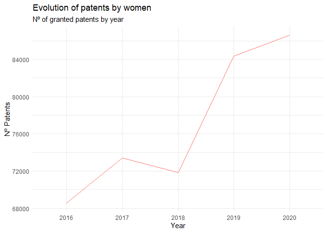

<!-- README.md is generated from README.Rmd. Please edit that file -->

# womeninventoR

<!-- badges: start -->
<!-- badges: end -->

The goal of the womeninventoR package is to share a patent data set of
women inventors for its analysis within R.


Data has been obtained from a a series of data tables that are available
for bulk download from USPTO’s Patentsview page here:
<https://patentsview.org/download/data-download-tables>

See the initial bulk downloading process followed by Paul Oldham
@poldham here:
<https://github.com/poldham/patentsview2021/blob/master/patentsview_bulk.Rmd>

The building of the patent dataset (´womeninventorpatents´) from the
downloaded files is described in the ´DATASET.R´ file included in the
´data-raw´ folder.

The data set contains nearly 400.000 granted patents by women inventors
in the US within 2016 and 2020. It contains main patent data fields as
columns (textual fields such as Title and Abstract and other useful
metadata such as Patent Classification Codes, names of assignee
organisations and publication dates)

## Installation

You can install it from [GitHub](https://github.com/) with:

``` r
# install.packages("devtools")
devtools::install_github("enricescorsa/womeninventoRs")
```

## Example

The womeninventoR package allows you to load the ´womeninventorpatents´
data set and analyse it.

``` r
library(womeninventoR)

womeninventorpatents
#> # A tibble: 384,852 x 10
#>    id       country date       title  abstract ipc_maingroup assignees inventors
#>    <chr>    <chr>   <date>     <chr>  <chr>    <chr>         <chr>     <chr>    
#>  1 10000001 US      2018-06-19 Injec~ The inj~ B29C/45;G05B~ LS MTRON~ Sun-Woo ~
#>  2 10000002 US      2018-06-19 Metho~ The pre~ B32B/7;B29C/~ KOLON IN~ Yun Jo K~
#>  3 10000010 US      2018-06-19 3-D e~ 3-D pri~ B29C/64;B29C~ XEROX CO~ Lynn Sax~
#>  4 10000018 US      2018-06-19 Pull ~ A stret~ B29C/65;B29C~ Apple In~ Liane Fa~
#>  5 10000019 US      2018-06-19 Insta~ An inst~ B29C/65;B32B~ The Boei~ Mary H. ~
#>  6 10000024 US      2018-06-19 Appar~ An appa~ G06F/19;B29C~ SAMSUNG ~ In-Hyok ~
#>  7 10000033 US      2018-06-19 Washa~ Disclos~ H01R/4;B31B/~ Blueavac~ Amy Geor~
#>  8 10000036 US      2018-06-19 High ~ Boron n~ B32B/5;F41H/~ UNITED S~ Sharon E~
#>  9 10000037 US      2018-06-19 Trans~ The pur~ B32B/7;B32B/~ DEXERIAL~ Emi Yosh~
#> 10 10000039 US      2018-06-19 Multi~ A multi~ B32B/17;B32B~ Solutia ~ Yalda Fa~
#> # ... with 384,842 more rows, and 2 more variables: kind <chr>,
#> #   patentsyear <chr>
```

First, let’s see the evolution in the number of granted patents through
time.

We can plot a line chart showing the number of patents by year.

``` r
library(tidyverse)
#> -- Attaching packages --------------------------------------- tidyverse 1.3.1 --
#> v ggplot2 3.3.5     v purrr   0.3.4
#> v tibble  3.1.4     v dplyr   1.0.7
#> v tidyr   1.1.3     v stringr 1.4.0
#> v readr   2.0.1     v forcats 0.5.1
#> -- Conflicts ------------------------------------------ tidyverse_conflicts() --
#> x dplyr::filter() masks stats::filter()
#> x dplyr::lag()    masks stats::lag()
#first we count the number of patents by year
patents_year <-  womeninventorpatents %>%
  group_by (patentsyear) %>%
  summarise (count=n ())

patents_year <-  na.omit(patents_year) # we use na.omit to exclude missing values


#then we can plot the line chart evolution
ggplot(data = patents_year, aes(x = patentsyear, y = count, group = 1)) +
    geom_line(aes(color = '#660F56')) + 
  theme_minimal() +
  labs(y = "Nº Patents",
       x = "Year",
       title = "Evolution of patents by women",
       subtitle = "Nº of granted patents by year") +
  theme(legend.position = "none")
```


